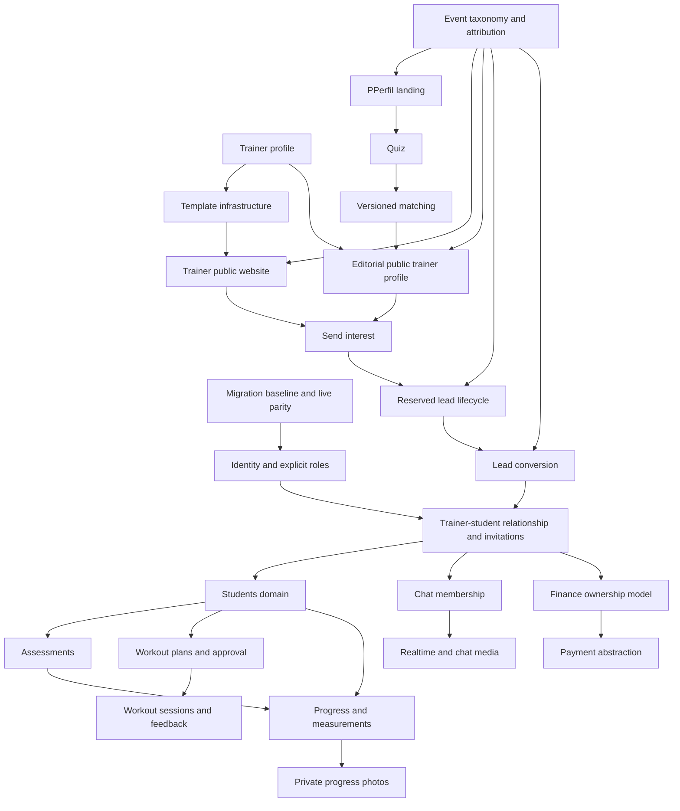

# PPerfil Technical Audit & Gap Analysis V1

**Audit date:** 2026-08-22
**Phase:** 0 - read-only technical audit
**Product source of truth:** `PPerfil_Product_UX_Master_Spec_v1_REVIEW.docx`
**Technical source of truth inspected:** repository at `C:\Users\jogue\OneDrive\Documentos\Thiago Pesonal Treiner`, branch `codex/initial-mvp`, commit `f5e7a33`, including the working tree as found
**Implementation status:** no application code, schema, configuration, dependency, or runtime behavior was changed.

## Audit scope and limitations

The repository was inspected statically, including application source, configuration, domain types, server actions, route handlers, migrations, SQL security assertions, RLS isolation tests, and existing technical documentation. The working tree contained extensive pre-existing tracked and untracked changes; those changes were treated as the current technical state and were not modified.

The configured hosted Supabase endpoint could not be resolved by DNS during the audit. Consequently, migrations are the verified repository schema, while live tables, policies, grants, functions, storage configuration, Auth settings, and migration history remain **UNKNOWN**. The repository does not contain `supabase/config.toml`, so a complete local Supabase project configuration is also not versioned. No migrations or tests were executed because Phase 0 prohibits database execution and environment changes.

The Master Spec was extracted completely, including its tables. Visual DOCX rendering was unavailable because LibreOffice is not installed; this did not prevent content comparison.

## 1. Executive Summary

PPerfil is currently a functional but narrow trainer-presence and lead-acquisition SaaS. Its strongest implemented slice is:

- email/password authentication and trainer onboarding;
- one trainer profile per authenticated user;
- two public-site templates with authenticated editing and preview;
- public trainer pages, services, testimonials, WhatsApp conversion, basic analytics;
- a public quiz, deterministic matching, lead capture, and trainer lead inbox;
- PostgreSQL RLS, column-level grants, tenant ownership checks, and SQL security gates.

It is not yet the operating platform described by the Master Spec. There is no explicit role model, student identity or trainer-student relationship, student portal, workout domain, assessments, progress, private photos, chat, notifications, finance/payment abstraction, realtime layer, or PWA infrastructure.

The correct direction is evolutionary, not a rewrite. Auth, Supabase SSR, trainer ownership, public routing, templates, server-side validation patterns, public analytics primitives, design tokens, and RLS testing should be retained. However, the domain model must be expanded before new screens are built. The first implementation domain should be **Identity, Roles, and Trainer-Student Relationship Foundation**, preceded by a short security/migration-baseline gate.

No confirmed CRITICAL security vulnerability was found in the repository. There are two HIGH-risk findings: the migration chain is not demonstrably self-contained, and public lead/analytics RPC abuse controls rely on attacker-rotatable client identifiers. Live Supabase parity is an unresolved blocker.

## 2. Current Architecture

### Runtime and framework

- Next.js `16.2.12`, App Router, React `19.2.4`, React DOM `19.2.4`.
- TypeScript 5 with `strict: true`; target ES2017; bundler module resolution.
- Supabase JS `2.112.3` and `@supabase/ssr` `0.12.4`.
- Tailwind packages are installed, but most styling is custom global CSS rather than Tailwind composition.
- Vercel/Next runtime is the documented hosting model. Historical commits/configuration show a prior Cloudflare static-export direction, but current `next.config.ts` no longer exports statically.
- No app-level testing framework, error-reporting SDK, payment SDK, realtime client usage, PWA plugin, or service worker exists.

### Request and data flow

1. `src/proxy.ts` delegates session refresh and route redirects to `src/lib/supabase/proxy.ts`.
2. Private pages and mutations re-check identity using `auth.getUser()`.
3. Server Actions validate form input and access Supabase using cookie-backed SSR clients.
4. RLS and controlled RPCs provide the final tenant boundary.
5. Public pages query published trainer data on the server.
6. Browser analytics and the public quiz call Next routes/Server Actions, which call controlled anonymous RPCs.

### Current architectural strengths

- Authentication is checked at both navigation and mutation/page boundaries.
- No service-role key is present or requested by application configuration.
- Public and owner projections are deliberately separated for trainer profiles and services.
- Public templates consume `TrainerPageData`, not Supabase clients.
- Server Actions generally combine explicit owner filters with RLS.
- The database contains reproducible RLS/security assertion SQL.

### Current architectural weaknesses

- `src/lib/supabase/trainers.ts` has become a broad data-access module for public pages, owner profiles, site builder, entitlements, dashboard analytics, and leads.
- `src/lib/domain/trainer.ts` mixes trainer profile, public-site, entitlement, offer, lead, and analytics types.
- `SiteBuilder.tsx` is a large client component containing multiple domains and mutation forms.
- Multiple global CSS files overlap, including contradictory desktop rules for `.bottom-navigation` at the same `min-width: 768px` breakpoint.
- Several route/action files are minified into single lines, reducing maintainability and reviewability.
- There are no `loading.tsx`, `error.tsx`, route-specific error boundaries, structured logs, tracing, or production observability.

## 3. Repository Map

| Area | Current responsibility | Assessment |
|---|---|---|
| `src/app` | App Router pages, layouts, Server Actions, API/redirect routes, global CSS | Functional; public-site, SaaS portal, and acquisition concerns are tightly co-located |
| `src/app/actions` | Auth, onboarding, profile, site builder, leads mutations | Useful server boundary; needs domain separation and consistent error contracts |
| `src/app/api/analytics` | Public analytics ingestion facade | Partial and intentionally narrow |
| `src/app/dashboard` | Trainer dashboard, profile, site, preview, leads | Only implemented Personal portal area |
| `src/app/p/[slug]` | Published trainer page/site | Conflates approved public trainer profile and trainer website concepts |
| `src/components/templates` | Template dispatch and two trainer sites | Strong reusable boundary |
| `src/components/dashboard` | Shell, navigation, profile editor, site builder | Reusable pieces exist; IA/Alunos/Treinos/etc. absent |
| `src/components/leads` | Quiz, lead settings, lead status | Functional beta; business states conflict with Master Spec |
| `src/components/sections` | Template 01 marketing sections | Six components appear unreferenced and are likely legacy/dead code |
| `src/lib/domain` | Types and one repository interface | Too trainer-centric and mixed for V1 expansion |
| `src/lib/supabase` | SSR/browser clients plus all trainer-facing adapters | Good client setup; data adapter is becoming a monolith |
| `src/lib/validation` | Auth/onboarding validation | Reusable pattern but incomplete coverage across domains |
| `src/data/trainers.ts` | Demonstration fallback profiles | Useful fixtures, risky as runtime fallback if production schema is missing |
| `supabase/migrations` | 13 additive migrations/security gates | Strong intent; fresh-install consistency is not proven |
| `supabase/tests` | Transactional tenant-isolation SQL | Valuable but limited to early profile isolation |
| `docs` | Architecture, security gate, data retention | Useful decision record; does not cover the new Master Spec architecture |
| `public/images` | Public template and marketing imagery | Reusable for current public-site concepts; licensing/provenance not audited |

### Routes currently present

| Route | Access | Current purpose |
|---|---|---|
| `/` | Public | Hard-coded lookup of demo trainer `rafael-martins`; not the approved PPerfil landing |
| `/signup`, `/login` | Public/auth-aware | Trainer email/password Auth |
| `/auth/confirm` | Public callback | Supabase code exchange with internal redirect protection |
| `/onboarding` | Authenticated | Trainer-profile creation only |
| `/dashboard` | Authenticated | Site status plus three acquisition metrics |
| `/dashboard/profile` | Authenticated | Trainer basics, photo, and email change |
| `/dashboard/site` | Authenticated | Templates, content, services, testimonials, contact, publication, commercial intent |
| `/dashboard/preview` | Authenticated | Standalone owner preview, including template query override |
| `/dashboard/leads` | Authenticated | Beta entitlement/configuration and assigned matches |
| `/dashboard/leads/[id]` | Authenticated | Lead details, WhatsApp, status update |
| `/encontre-seu-personal` | Public | Quiz and match results |
| `/p/[slug]` | Public | Published template site plus profile analytics |
| `/go/whatsapp/[slug]` | Public | Tracked WhatsApp redirect |
| `/api/analytics` | Public POST | Analytics RPC bridge |
| `/privacy`, `/terms` | Public | Explicit placeholder legal text |

## 4. Current Database Map

This map represents repository migrations, not a verified live database.

| Table | Purpose | Important columns | Relationships | RLS / grants | Used by | Notes / risks |
|---|---|---|---|---|---|---|
| `trainer_profiles` | Trainer identity and public-site configuration | `user_id`, `slug`, names, bio, specialty, CREF, location, media URLs, WhatsApp, template, color, `published` | `user_id -> auth.users`; parent of most trainer tables | RLS: public reads published rows; owner CRUD. Public column grant excludes `user_id` | Auth onboarding, dashboard, templates, matching | `professional_name` exists in SQL but not `TrainerProfile`; role is implicitly trainer |
| `services` | Trainer commercial/service offerings | title, description, price, legacy `price_visible`, mode, currency, billing type, `price_visibility`, active | `trainer_id -> trainer_profiles` | Owner CRUD; public access through `get_public_services` RPC | Site builder, public templates, matching | `price_visible` duplicates `price_visibility`; migration needed eventually |
| `testimonials` | Manually entered public testimonials | student name/content, three image URL fields, context, published | `trainer_id -> trainer_profiles` | Public reads published testimonials of published trainer; owner CRUD | Site builder/templates | Not linked to a student or consent record; old image deletion/retention is incomplete |
| `trainer_entitlements` | Feature/template/publication/matching gates | overlapping template flags, publish/build/preview/leads/matching booleans | PK/FK `trainer_id -> trainer_profiles` | Owner read only; defaults created by trigger | Dashboard, site builder, leads | Duplicate legacy/new flags; current FREE behavior is a launch assumption, not approved V1 policy |
| `custom_site_requests` | Manual upsell/request workflow | JSON brief, reference URLs, WhatsApp, status | `trainer_id -> trainer_profiles` | Owner select/insert | Site builder | Separate bespoke-site commercial flow is not in Master Spec V1 |
| `commercial_offers` | Configured publication offer | code, label, price, currency, payment label, enabled | Referenced by purchase intents | Authenticated reads enabled rows; no client mutation | Publication paywall | Seeded `founder_offer` and price conflict with unresolved monetization decisions |
| `publication_purchase_intents` | Interest in publication offer | offer snapshot, status, timestamps | Trainer and offer FKs | Owner read; mutation only through RPC | Site builder | Not a payment abstraction; founder/publication-specific legacy |
| `trainer_lead_settings` | Matching eligibility/preferences | objectives array, mode/location, service UUID array, accepting flag | Trainer FK; service IDs are an array without FK | Owner read; controlled RPC write | Leads setup/matching | Service references can become stale outside RPC; structure may need normalization |
| `student_leads` | Public prospect PII and quiz answers | name, WhatsApp, email, goal, mode/location, budget, timing, consent, session hash | Parent of matches and analytics | Only matched trainers can select; anonymous creation via SECURITY DEFINER RPC | Public quiz, lead inbox | Name suggests students but rows are prospects; no expiry/reservation columns or retention enforcement |
| `lead_matches` | Assignment and score between lead and trainer | lead, trainer, score, status, timestamps | FKs to lead and trainer | Trainer reads own; controlled status RPC | Match results and trainer leads | Statuses `new/contacted/won/lost` conflict with approved `Novo/Pendente/Convertido/Rejeitado/Expirado`; no 3-day reservation |
| `analytics_events` | Basic append-only acquisition events | type, trainer, lead, anonymous hash, timestamp | Optional trainer/lead FKs | No direct API-role reads; writes/aggregation through RPCs | Profile analytics/dashboard | Only five events; no CTA start/submit funnel completeness, origin, conversion link, retention partitioning, or anti-abuse strong enough for trusted metrics |

### Enums

- `service_mode`: `online`, `presencial`, `both` - reusable.
- `template_id`: `template_01`, `template_02` - usable now but structurally rigid for a growing template catalog.

### Functions and triggers

Key controlled RPCs: `create_trainer_profile`, `get_my_trainer_profile`, `get_public_services`, `get_my_services`, `set_my_site_template`, `set_my_site_publication`, `register_publication_purchase_intent`, `configure_my_leads_beta`, `create_student_lead_and_match`, `set_my_lead_match_status`, analytics recorders, and `get_my_dashboard_metrics`.

All reviewed exposed RPCs that cross RLS use `SECURITY DEFINER` with an empty `search_path`, explicit grants, and ownership/identity checks appropriate to their current purpose. The private ownership helper and entitlement trigger are also `SECURITY DEFINER`.

Triggers:

- `create_default_trainer_entitlements` inserts default entitlements after trainer creation.
- Migration `202608140004` revokes execution on `public.rls_auto_enable()`, but no repository migration creates that function. This makes the migration chain dependent on unversioned prior state or causes a fresh migration failure.

### Storage

- Bucket `trainer-public-media` is public, 5 MB per object, limited to JPEG/PNG/WebP.
- Authenticated writes require the first path segment to equal `auth.uid()`.
- It is appropriate for public trainer-site media, not for the Master Spec's private student progress photos.
- No private progress/assessment/chat bucket exists.

### Live Supabase discrepancy status

The project URL configured in `.env.local` did not resolve. Therefore:

- repository-to-live table/column parity: **UNKNOWN**;
- applied migration versions: **UNKNOWN**;
- current RLS/grants/function definitions: **UNKNOWN**;
- Auth settings, password protection, redirect URLs: **UNKNOWN**;
- live buckets and storage policies: **UNKNOWN**.

Existing docs claim migrations `001-004` were applied and a hosted Security Gate passed on 2026-08-14, but later migrations `005-013` have no equivalent live-state evidence in the repository. This must be resolved before any V1 migration design.

## 5. Auth & Authorization

### Current model

- Supabase email/password Auth with confirmation callback.
- Middleware-like proxy refreshes cookies and redirects protected/auth routes based on claims.
- Private pages and Server Actions use `auth.getUser()` rather than trusting client state.
- Exactly one `trainer_profiles` row per `auth.users` row.
- No role table, role enum, membership table, student identity, admin role, or role-aware routing.
- Every onboarded account is implicitly a Personal Trainer.

### Master Spec gap

The Master Spec requires visitor, Personal, and student contexts in one web app. Existing Auth can remain, but authorization must be refactored around explicit roles and relationships. Do not encode all access solely in mutable JWT metadata or client-side route selection. The database must express which trainer can access which student and which student owns each workout/progress item.

### Recommended authorization direction

- Keep Supabase Auth and SSR cookie clients.
- Add a stable application user/profile identity and explicit role/membership model.
- Model trainer-student relationships with lifecycle and invitation state.
- Derive access to workouts, assessments, progress, photos, chat, and finance from that relationship.
- Preserve RLS as the final boundary and add cross-role/cross-trainer SQL tests before UI work.

## 6. RLS / Security Findings

### CRITICAL

No confirmed CRITICAL finding from repository evidence.

### HIGH

#### H-01 - Migration chain is not demonstrably self-contained

`202608140004_function_surface_hardening.sql` references `public.rls_auto_enable()` although no checked-in migration creates it. A clean environment can fail before later security changes are applied, or the repository may depend on undocumented live-only state. Impact: unreliable disaster recovery, onboarding, staging parity, and security posture. Report only; validate against an isolated clone and reconcile migration history before new migrations.

#### H-02 - Anonymous abuse controls are based on a client-rotatable identifier

Public lead and analytics RPCs trust a hash derived from a client cookie as their rate/deduplication identity. A caller can rotate or directly supply valid-looking 64-character hashes to RPCs. `record_public_analytics` and `record_lead_form_started` can also be invoked directly by `anon`. Impact: lead spam, analytics poisoning, database growth, operational load, and degraded matching trust. Existing honeypot and per-hash limits are useful but not a strong abuse boundary.

### MEDIUM

#### M-01 - Live security state is unverifiable

The configured Supabase hostname is not resolvable. The audit cannot confirm that repository RLS, grants, security-definer definitions, storage policies, or later migrations exist in production. Treat go-live/security claims as unverified until project identity and access are restored.

#### M-02 - Lead lifecycle and retention do not implement the approved reservation policy

There is no `expires_at`, reservation state, expiry job, or conversion transaction. Prospect PII can remain indefinitely. The existing retention document explicitly defers deletion/anonymization. This is both a product-integrity and LGPD operations risk.

#### M-03 - Public storage lifecycle is incomplete

Replacing profile/hero/logo/testimonial media generally leaves old objects public. Deleting a testimonial does not delete its associated image. The public bucket is not suitable for future progress photos, which require restricted access and deletion controls.

#### M-04 - Analytics integrity is not trustworthy for business decisions

Anonymous callers can inflate events; WhatsApp clicks are not deduplicated; there is no origin attribution, full site funnel, conversion linkage, or reconciliation. The dashboard labels one note as unavailable even while showing basic real metrics, which can confuse operational interpretation.

#### M-05 - Legal/consent implementation is incomplete

Privacy and Terms pages explicitly state they are placeholders. Lead consent stores a timestamp but no terms/privacy version, source text version, withdrawal status, or subject-request workflow. Testimonials have no stored proof/scope of student consent.

#### M-06 - Role expansion without a new authorization model would create IDOR risk

Current trainer-only RLS is generally sound. However, adding student routes to the existing trainer-centric model without relationship-scoped policies would risk cross-trainer and cross-student access. This is a forward architecture risk, not a confirmed current exploit.

### LOW

#### L-01 - Mutation and data errors are frequently swallowed

Several paths return generic messages or fallback zero metrics; `setLeadStatus` ignores RPC errors. This limits detection and can present stale UI as success/no-op.

#### L-02 - Runtime demo fallback can mask missing hosted schema

Public profile lookup falls back to mock trainers on `PGRST205`. Useful for demonstrations, but it can hide a broken/missing live table and produce misleading availability.

#### L-03 - Public redirect origin has a localhost fallback

The WhatsApp redirect uses `NEXT_PUBLIC_SITE_URL || http://localhost:3000` for the missing-profile redirect. Misconfiguration in production could produce an incorrect redirect.

### INFORMATIONAL / positive controls

- No service-role usage was found.
- Secrets are not expected in `NEXT_PUBLIC_*` beyond browser-safe Supabase keys.
- Public trainer projection excludes `user_id` at both TypeScript and PostgreSQL-grant levels.
- Owner mutations generally include an owner/trainer filter in addition to RLS.
- Storage writes validate file signatures and enforce size/type limits.
- Auth callback validates internal redirect paths against protocol-relative escape.
- Existing SQL gates cover cross-trainer profile isolation, storage path ownership, entitlement enforcement, testimonial isolation, lead isolation, and selected grant assertions.

## 7. Existing Product Capabilities

### Functional now

- Trainer signup/login/logout/email confirmation.
- Three-step trainer onboarding.
- Trainer profile management and public-site media upload.
- Two template renderers with selectable theme/color and authenticated preview.
- Services and manually entered testimonials.
- Publication state and public slug routing.
- WhatsApp CTA tracking and public page view tracking.
- Public quiz without pre-registration.
- Server-side deterministic top-three matching.
- Trainer matching preferences, entitlement gate, lead list/detail, and four-state status update.
- Three dashboard acquisition metrics.

### Partial or conceptual

- Dashboard is a site/acquisition summary, not the operational cockpit.
- Analytics is a minimal event counter, not the approved site funnel.
- Leads is a beta acquisition flow without reservation, expiry, rejection/rematch, or conversion-to-student.
- Settings consists only of profile and email basics.
- Public trainer page and public trainer website are represented by one template-driven route.
- Commercial flow records publication interest but does not process payment.
- Some unused marketing components visually describe workout/app experiences that have no data model or functionality.

### Not implemented

Roles, students, invitations, student onboarding/portal, workouts and execution, AI drafts, assessments, progress, measurements, restricted photos, chat, notifications, finance, payment abstraction, realtime, PWA/offline, full landing/match marketplace, lead reservation/expiry/conversion, operational observability, and application automated tests.

## 8. Master Spec Gap Analysis

### Foundation

Auth and SSR session handling are reusable. Explicit Personal/student roles, relationship-scoped authorization, invitation identity linking, permission-denied states, and role-aware navigation are absent. Foundation therefore requires **REFACTOR + BUILD + MIGRATE**, not replacement of Supabase Auth.

### Personal portal

Only Dashboard, Leads, My Site, and limited Settings exist. The dashboard and leads require substantive domain alignment. Students, Workouts, Assessments, Progress, Chat, and Finance require new domains. The current four-item bottom navigation conflicts with the approved Personal navigation and uses mobile-first behavior even on desktop.

### Student portal

No student portal domain or route exists. Unused visual marketing components must not be mistaken for implementation. This entire context is **BUILD**, dependent on roles and trainer-student relationships.

### Public acquisition

Quiz, match results, public trainer presentation, and lead creation provide a meaningful base. The root route is not the PPerfil landing; it renders a demo trainer site. The quiz omits level/experience and availability. Matching weights are hard-coded even though exact criteria remain an open product decision. Lead statuses and reservation semantics conflict with the approved rules.

### Platform

Basic analytics and public storage exist. There is no notification infrastructure, private storage, realtime, payment-provider abstraction, PWA/offline layer, or consolidated responsive design system for both portal contexts.

## 9. KEEP / REFACTOR / REMOVE / BUILD / MIGRATE Matrix

| Domain | Current state | Master Spec requirement | Classification | Dependencies | Risk | Recommended action |
|---|---|---|---|---|---|---|
| Supabase Auth | Email/password, confirmation, SSR cookies | Shared Auth for Personal and student | REFACTOR | Role model | High | Keep provider/client setup; add role-aware post-login routing and invitation flows |
| Personal role | Implicit: every profile owner is a trainer | Explicit Personal permissions | MIGRATE | Identity design | High | Backfill current users as Personal after schema approval |
| Student role | None | Explicit student experience and permissions | BUILD | Identity, invitations | High | Add role/membership model before student screens |
| Permission model | Trainer ownership only | Visitor/student/Personal matrix | REFACTOR | Roles, relationships, RLS | Critical | Design resource-by-resource RLS and denial states |
| Personal dashboard | Site status + 3 metrics | Operational cockpit | REFACTOR | All Personal domains | Medium | Keep shell/cards; progressively connect real modules |
| Leads | Beta inbox with 4 incompatible statuses | 5 states, visible 3-day reservation, reject/convert | MIGRATE | Relationship, expiry mechanism | High | Evolve state machine and timestamps; preserve lead data |
| Lead conversion | `won` status only | Transaction creates student and invitation | BUILD | Students, invitations | High | Implement atomic conversion service/RPC |
| Students list/detail | None | Active/inactive list and six detail areas | BUILD | Roles, relationship | High | First operational domain after foundation |
| Workouts | Visual marketing mock only | Draft/approved/published/archived plans | BUILD | Students, exercise schema | High | Model plans/versioning before UI |
| AI workout draft | None | Assistive draft, human approval | BUILD | Workout model, AI governance | High | Add only after deterministic workout workflow |
| Workout execution/feedback | None | Mobile one-hand execution, sessions, timer, feedback | BUILD | Published workouts, student portal | High | Separate plan from immutable execution/session records |
| Assessments | None | Request/respond/review/conclude | BUILD | Students, storage | High | Use explicit lifecycle and form-version model |
| Progress/measurements/photos | None | Restricted measures/photos and comparisons | BUILD | Relationships, private storage, consent | Critical | Design privacy/retention before uploads |
| Chat | None | Async text/media/context; no calls | BUILD | Relationships, realtime, storage | High | Establish conversation membership and message policies |
| Finance | Publication interest only | Provider-agnostic trainer receivables | BUILD | Commercial decisions, payment abstraction | High | Do not reuse publication intent as ledger/payment model |
| Trainer settings | Profile/email basics | Profile, account, notifications, appearance, integrations, plan, privacy | REFACTOR | Roles, notification, legal | Medium | Keep editor primitives; split into settings domains |
| My Site information architecture | One large Site Builder flow | Overview, Templates, Customize, Contact, Performance | REFACTOR | Analytics, CTA model | Medium | Split information architecture without rebuilding templates |
| Template renderers | Two data-driven templates | Professional template-based sites | KEEP | Stable public DTO | Low | Preserve `TrainerTemplate` boundary and both templates |
| Template catalog | Enum with two fixed IDs | Templates with unresolved entitlements | REFACTOR | Product pricing decision | Medium | Keep V1 IDs; avoid hard-coding future catalog logic further |
| Site customization | Profile/services/testimonials/contact/color/media | Limited permitted editing | KEEP | UX restructuring | Low | Reuse actions/forms after decomposing monolith |
| Standalone preview route | Dedicated `/dashboard/preview` and flow step | No redundant preview/publication session | REMOVE | Integrated editor preview | Low | Retire as a separate product step after equivalent inline/template preview exists |
| Publication state | Manual publish/unpublish plus entitlement | Public status still necessary, UX should be subtle | REFACTOR | Entitlement decision | Medium | Keep state technically; simplify UX and naming |
| CTA/contact choice | WhatsApp-only behavior | PPerfil, WhatsApp, or both | BUILD | Lead form, analytics | Medium | Add explicit contact-mode field and CTA configuration |
| Site analytics | 3 aggregate counters | Visits through converted students, origin and insights | MIGRATE | Event taxonomy, conversion | High | Extend events and attribution; preserve existing history |
| Public PPerfil landing | Root renders one demo trainer template | Editorial PPerfil acquisition landing | REMOVE | Public design/content | Medium | Replace current root behavior; reuse suitable section primitives selectively |
| Public quiz | 6-step form, no registration | Premium discovery with specified questions | REFACTOR | Matching decision | Medium | Add missing questions and preserve no-login result flow |
| Matching engine | Hard-coded SQL score/top 3 | Approved criteria/weights still undecided | REFACTOR | Product decision | High | Version scoring policy; do not cement current weights |
| Match results | Cards with score/profile link | X matches, compatibility, public profile | KEEP | Public profile split | Low | Reuse result UI and DTO with accessibility/content refinements |
| Public trainer profile | Same route/rendering as trainer website | Distinct editorial conversion profile | REFACTOR | Public information architecture | Medium | Separate profile purpose from selected site template |
| Send interest | Quiz submission creates lead and matches | Simple CTA form, preference, reserved lead | REFACTOR | Contact choice, lead lifecycle | High | Support profile-origin interest and reservation transaction |
| Trainer public websites | `/p/[slug]` template-driven site | Public trainer sites | KEEP | Routing decision | Low | Retain renderer/data projection; choose distinct route/domain strategy |
| Analytics events | Five append-only event types | Platform/site funnel and conversion | MIGRATE | Taxonomy, retention | High | Version schema, add source/session/conversion fields and abuse protection |
| Notifications | None | In-app/email/web-push decisions pending | BUILD | Roles, events, product decision | Medium | Build an outbox/preference foundation only after channel decisions |
| File storage | One public trainer-media bucket | Public assets plus private progress/chat/assessment media | MIGRATE | Privacy/retention | Critical | Keep public bucket; add separate private buckets/policies |
| Realtime | None | Chat and possibly live updates | BUILD | Chat model | Medium | Add only for domains that need it |
| Payment abstraction | None | PSP-neutral integration | BUILD | Commercial decisions | High | Define provider interface, ledger and webhook model before PSP integration |
| PWA/offline | None | Responsive Web App/PWA, offline/retry states | BUILD | Route/data strategy | Medium | Add manifest/installability first; define limited offline behavior explicitly |
| Responsive architecture | Extensive CSS and mobile layouts; conflicting desktop nav rules | Personal desktop-first; student mobile-first | REFACTOR | Portal shells | Medium | Create separate Personal and student layout tokens/breakpoints |
| Commercial offers/founder offer | Seeded publication offer and purchase intent | Monetization still open | MIGRATE | Product/commercial decision | High | Freeze expansion; decide archive/transform strategy before schema changes |
| Custom-site upsell | Manual bespoke request | Not defined in approved V1 | REMOVE | Commercial decision | Low | Remove from V1 navigation after business confirmation; retain data until disposition approved |
| Legal/privacy | Placeholder pages | Final LGPD/terms/consent | REFACTOR | Legal decisions | High | Version consents and implement subject/deletion workflows after counsel input |
| Observability | Console-only development analytics | Operational error/flow visibility | BUILD | Hosting/tooling choice | Medium | Add structured server logs, error boundaries, request correlation, and alerts |
| Automated tests | SQL security gates only | Critical-flow tests per sprint | REFACTOR | Test tooling | High | Keep SQL gates; add unit/integration/E2E without weakening database tests |

## 10. Legacy Feature Review

| Legacy concept | Evidence | Decision | Why |
|---|---|---|---|
| Preview/publication UX | Standalone preview route, four-step flow, publication paywall | REFACTOR + REMOVE standalone step | Preview rendering is valuable; redundant session conflicts with approved editor behavior |
| Current Meu Site | One monolithic page with all controls | REFACTOR | Most capabilities align, but IA and component boundaries do not |
| Template selection | Two reusable renderers and entitlement RPC | KEEP | Strong existing asset aligned with template-based sites |
| Template customization | Limited content/media/color editing | KEEP | Matches “not a drag-and-drop builder”; decompose UX only |
| Free/premium template assumptions | Both current templates enabled for FREE after migration 009; old generic flags remain | MIGRATE | Product explicitly has not finalized free/premium rules |
| `can_build_site` | Stored/read but no meaningful behavioral enforcement | MIGRATE | Dead/latent flag; consolidate after entitlement model decision |
| `can_preview_site` | Stored/read but preview route does not enforce it | MIGRATE | Flag and behavior are inconsistent |
| `can_publish_site` | Enforced by publication RPC and UI | REFACTOR | Keep capability concept if needed, but align to final plan model |
| `can_receive_leads` | Enforced by matching/settings and UI | REFACTOR | Useful control, but approved lead access rules/commercial model are unresolved |
| `commercial_offers` | Enabled offer table | MIGRATE | Generic table may be reusable; current publication-specific semantics are narrow |
| `founder_offer` | Seeded price and dedicated UI | REMOVE from V1 flow pending archive decision | Hard-coded commercial assumption conflicts with open Master Spec decisions |
| FREE behavior | Build/preview/templates allowed; publish/leads disabled | MIGRATE | Current launch behavior is not approved final entitlement policy |
| Public/private trainer profile | `published` controls public read | KEEP | Sound primitive; needs separation of public-profile vs public-site products |
| Current quiz | Functional public multi-step acquisition | REFACTOR | Strong base; missing approved questions and policy-versioned matching |
| Current leads | Secure trainer-scoped beta inbox | MIGRATE | Preserve PII/matches but evolve state machine, expiry and conversion |
| `student_leads` naming | Prospects, not authenticated students | MIGRATE | Rename/domain separation is needed before real Students are added |

No data-bearing legacy table should be dropped until a migration/backfill/archive decision and live-state inventory are approved.

## 11. Reuse Opportunities

### Reuse without rebuilding

- Supabase SSR clients, config guard, cookie refresh, `requireUser`, and safe auth callback.
- `private.owns_trainer` ownership concept and RLS-first testing approach.
- `TrainerRepository` boundary and explicit public DTO/projection pattern.
- `TrainerTemplate`, `Template01`, `Template02`, and their public page sections.
- Trainer profile, services, testimonials, media upload validation, and public-media bucket for public assets only.
- Auth/onboarding form patterns using `useActionState` and server validation.
- Dashboard header/avatar/brand, form messages, status badges, empty-state patterns, and design tokens.
- Public quiz progress/options/match-card UI and no-registration result behavior.
- Visitor hash as a deduplication signal, but not as the only anti-abuse control.
- Event ingestion/aggregation concept and existing analytics history.
- SQL security gates and transactional cross-tenant fixtures.
- `service_mode`, public slug routing, and tracked WhatsApp redirect.

### Reuse after refactor

- Split `trainers.ts` into profile/site, leads, analytics, and future student repositories.
- Split `trainer.ts` into domain modules and generated/validated database DTOs.
- Decompose `SiteBuilder.tsx` into My Site areas from the Master Spec.
- Convert current global CSS tokens into explicit public/Personal/student visual contexts.
- Reuse lead rows as acquisition records while creating a separate student domain.

## 12. Technical Debt

### Confirmed or strongly indicated dead code

The following exported components have no import outside their own files: `TrustBar`, `PainPointsSection`, `BenefitsSection`, `AudienceSection`, `AppExperienceSection`, `AboutSection`, `PlaceholderPage`, and `EmptyState`. Some describe future functionality visually and could mislead reviewers into believing it exists.

### Duplicate/obsolete abstractions

- `price_visible` and `price_visibility` encode the same decision.
- `can_use_free_template`/`can_use_premium_templates` overlap `can_use_template_01`/`can_use_template_02`.
- `can_build_site` and `can_preview_site` are selected into the app but not enforced consistently.
- `professional_name` is collected/stored but absent from the main domain interface and public projection string.
- Root demo configuration in `siteConfig` overlaps dynamic trainer data and PPerfil product configuration.
- Public trainer profile and trainer website are one implementation despite two product purposes.

### Coupling and maintainability

- Repository and type modules are trainer-centric monoliths.
- Site Builder and some leads files are dense/minified.
- Global CSS includes legacy landing, template, and SaaS layers with selector overlap.
- Two contradictory `@media(min-width:768px)` navigation blocks make desktop behavior source-order dependent.
- Error handling lacks typed categories and observability.
- No generated database types exist; manual interfaces can drift from SQL, as shown by `professional_name`.
- No application tests protect Server Actions, routes, UI state machines, or responsive behavior.
- No versioned local Supabase config is present.

## 13. Dependency Graph

The actual critical path is database/auth foundation -> trainer-student relationship -> operational student domains. Screen order in the Master Spec should not override this dependency order.

## 14. Architecture Risks

1. **Building screens before roles/relationships:** would force authorization retrofits across every student resource.
2. **Designing migrations without live parity:** could overwrite or conflict with unversioned hosted state and the unexplained `rls_auto_enable` dependency.
3. **Treating leads as students:** would mix anonymous prospect PII with authenticated student health/progress data and incompatible retention rules.
4. **Using the public media bucket for student data:** would violate the Master Spec's restricted-photo requirement.
5. **Expanding current monoliths:** adding every V1 domain to `trainer.ts`, `trainers.ts`, `SiteBuilder.tsx`, and global CSS would make ownership and testing progressively harder.
6. **Hard-coding unresolved product rules:** matching weights, template entitlements, pricing, payment split, notification channels, and retention remain open decisions.
7. **Relying on UI checks:** future student/trainer separation must be enforced in RLS and server boundaries.
8. **Using current analytics as trusted funnel data:** public event abuse and missing attribution can produce false product conclusions.
9. **Shipping without test/observability expansion:** current generic failures can silently mask data and authorization issues.
10. **Conflating public profile and website:** prevents clear acquisition journeys and analytics attribution.

## 15. Recommended Implementation Order

### Gate 0 - Baseline integrity before feature work

- Restore/confirm hosted Supabase project access.
- Export read-only live inventory: migrations, schema, functions, policies, grants, buckets, Auth settings.
- Prove a clean migration replay in an isolated environment and resolve `rls_auto_enable` provenance.
- Decide how existing users are classified and backfilled.
- Freeze unresolved monetization/matching/retention assumptions.

### 1 - Identity, roles, relationships, and portal shells

- Explicit Personal/student roles or memberships.
- Trainer-student relationship and invitation lifecycle.
- Role-aware routing/navigation and RLS matrices.
- Separate Personal desktop-first and student mobile-first shells.

### 2 - Students

- Active/inactive list, detail, relationship status, invitation acceptance, audit history.
- Conversion transaction from lead to student relationship.

### 3 - Assessments and progress foundation

- Assessment lifecycle, responses, measurements, privacy/retention model.
- Private storage architecture before progress photos.

### 4 - Workouts

- Plan/draft/version/approval/publication model.
- Student execution sessions and feedback after plan workflow is stable.
- AI draft only after deterministic authoring/approval works.

### 5 - Chat and notifications foundation

- Conversation membership, messages, attachments, realtime authorization.
- Outbox/preferences; channels only after product decision.

### 6 - My Site and public acquisition alignment

- Restructure existing My Site, preserve templates/customization.
- Separate public profile from trainer website.
- Replace root demo with PPerfil landing.
- Evolve quiz, versioned matching, reservation/expiry/rematch, conversion.

### 7 - Analytics and finance

- Trusted funnel taxonomy, origin attribution, conversion linkage, retention.
- Provider-neutral finance/payment model after commercial decisions.

### 8 - PWA, hardening, and release readiness

- Manifest/installability, explicit offline scope, performance, accessibility, responsive validation.
- Cross-role RLS gates, app tests, observability, incident runbooks, privacy operations.

## 16. Open Questions / Decisions Required

### Blocking technical decisions

1. Which hosted Supabase project is authoritative, and why is the configured hostname unresolved?
2. What created `public.rls_auto_enable()`, and should it be captured or removed from the baseline?
3. Are migrations `005-013` applied live? Are there live-only tables/policies/functions?
4. Can one user hold both Personal and student roles, or exactly one role?
5. Can a student have multiple Personals concurrently or historically?
6. What relationship states and invitation expiry rules are required?
7. What is the authoritative split between public trainer profile and trainer website routes/data?
8. What retention/deletion policy applies separately to prospects, students, assessments, chat, and photos?

### Product/commercial decisions already open in the Master Spec

- Monetization and price model.
- Template free/premium rules and final entitlements.
- PSP, split, and settlement behavior.
- Matching criteria and exact weights.
- Personal/CREF verification policy.
- Final assessment fields/types.
- Photo storage limits and retention.
- Notification channels.
- Public domain/subdomain strategy.
- Final legal text and consent language.

### Additional audit decisions

- Should `custom_site_requests` remain in V1 or move to a separate commercial backlog?
- Should existing demo profiles remain fixtures only, rather than runtime fallbacks?
- What event-abuse control is acceptable: edge rate limits, CAPTCHA/challenge, signed server facade, or a combination?
- What observability platform and data-classification rules are approved?

## 17. Proposed Sprint Boundaries

### Sprint 0A - Technical source-of-truth recovery

**Scope:** live inventory, clean migration replay, schema diff, baseline decision record.
**Exit:** repository can recreate an isolated database; live differences are explicitly classified; no unknown security-definer function provenance.

### Sprint 0B - Identity/authorization design

**Scope:** role/relationship ADR, RLS matrix, migration/backfill plan, threat model, test plan.
**Exit:** all cross-role access rules and user migration behavior approved before implementation.

### Sprint 1 - Roles, relationships, invitations, portal shells

**Scope:** schema/RLS, role-aware auth routing, Personal/student shells, invitation acceptance.
**DoD:** cross-user/cross-trainer SQL tests; loading/empty/error/permission states; responsive validation.

### Sprint 2 - Students and lead conversion

**Scope:** students list/detail foundation, active/inactive lifecycle, atomic lead conversion and invitation.
**DoD:** duplicate conversion protection, expiry semantics, audit history, tenant isolation.

### Sprint 3 - Assessments, measurements, and privacy foundation

**Scope:** assessment workflow, measurement history, private storage/retention design.
**DoD:** authorization and deletion tests; no public student assets.

### Sprint 4 - Workout authoring and approval

**Scope:** plan versions, exercises, draft/approved/published/archived lifecycle.
**DoD:** Personal-only approval and student-only published visibility.

### Sprint 5 - Student Today, execution, and feedback

**Scope:** Today, workout session, series completion, timer, terminal feedback.
**DoD:** mobile one-hand usability, resumable state, offline/retry decisions tested.

### Sprint 6 - Progress and photos

**Scope:** metrics, comparisons, private photos, explicit deletion and visibility.
**DoD:** privacy review, retention enforcement, audit tests.

### Sprint 7 - Chat and notification foundation

**Scope:** conversations/messages/attachments, realtime policies, in-app events/outbox.
**DoD:** relationship-scoped access, attachment privacy, reconnect/error behavior.

### Sprint 8 - My Site alignment and site analytics

**Scope:** restructure current site builder, remove redundant preview step, CTA modes, full funnel events.
**DoD:** current templates/data preserved; attribution and event abuse controls validated.

### Sprint 9 - Public acquisition alignment

**Scope:** PPerfil landing, quiz completion, versioned matching, editorial profile, interest reservation/rematch.
**DoD:** no pre-result signup, three-day lifecycle, conversion integration, public accessibility/performance.

### Sprint 10 - Finance abstraction

**Scope:** only after approved provider/monetization decisions; provider-neutral domain and reconciliation model.
**DoD:** webhook/idempotency/security design and no PSP-specific leakage into core ledger.

### Sprint 11 - PWA and release hardening

**Scope:** installability, explicit offline support, application tests, observability, performance, accessibility, LGPD operations, production readiness.
**DoD:** critical journeys, cross-role security gates, monitoring/runbooks, and go-live checklist approved.

---

**PHASE 0 CONCLUSION:** PPerfil should evolve from its existing secure trainer-site/leads core. It should not be rewritten, and it should not proceed directly to feature screens. The immediate prerequisite is a verified database baseline followed by the Identity, Roles, and Trainer-Student Relationship foundation.
